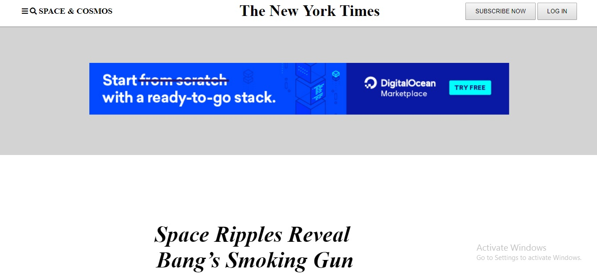

<h2>New York Times website clone</h2>
This is part of the microverse course project.
It is a clone of the New York Times website which is available <a href="https://www.nytimes.com/2014/03/18/science/space/detection-of-waves-in-space-buttresses-landmark-theory-of-big-bang.html?_r=0">here</a>. A preview is available below:

Live Project 
https://raw.githack.com/ngodi/New-York-Times-clone/development/index.html

<h3>Author</h3>

Ngodi albert

<h3>Contributors<h3>

Ngodi Albert (@ngodi) 

